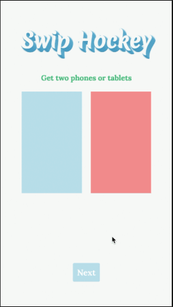

Swip Hockey
========= 

## Features

* Play air hockey on multiple devices
* Pinch to turn two screens into one screen

---

## Setup

#### Get the source code  

	git clone https://github.com/dtk0528/blog.git
	cd swip-hockey
	
#### Download and install all the dependencies

	yarn install
  
---
	
## Usage

#### Build swip.js

	yarn run build

#### Build server and client

	yarn run build:hockey

#### Start the server

	yarn start

#### Open a browser and go to

	localhost:3000

---

## Built With

* [Express](http://expressjs.com/) - Web framwork for Node.js
* [Redux](http://redux.js.org/) - Predictable state container for JavaScript apps
* [socket.io](https://socket.io/) - Realtime application framework (Node.JS server)
* [swip.js](https://github.com/paulsonnentag/swip) - A library to create multi device experiments
* [Webpack](https://webpack.github.io/) - A module bundler for javascript and more

---

## License

This project is under the MIT license. You are free to do whatever you want with it.

